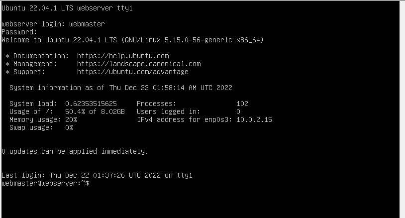
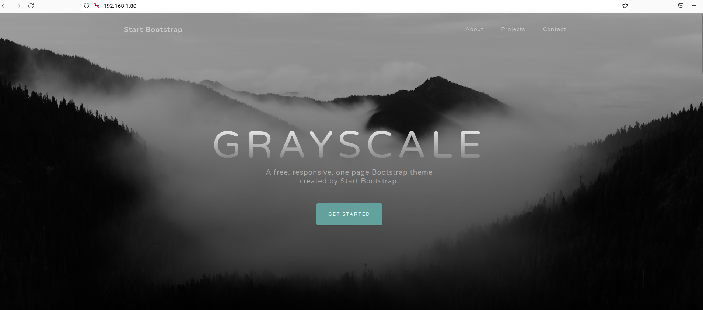

# Deliverable 1

## Concepts I dont understand:
* Apache HTTP Server:
  * Apache HTTP server is a free open source platform web server software.
* TLS/SSL encrypted traffic
  * SSl stands for Secure Sockets Layer: 
    * It makes sure data transferred between users and sites, or between two systems remain impossible to read, uses encryption algorithm to scramble data in transit
  * TLS, Transport Layer Security 
    * Updated more secure version of SSL
* Why are specific ports are opened for certain things?
  * Each port is associated with a specific process or service, which allow for different kinds of traffic such as surfing the web or sending an email
* Domain:
  * Basically the name of the website
* Virtual Hosts
  * Running more than one website on one machine 

## What is a web server? Hardware and software side
* Hardware side:
  * A web server is a computer that stores web server software and a websites component files, it can connect ot the internet and support physical data interchange with other devices connected to the web.
* Software side
  * A web server includes several parts that control how web users access hosted files. 

## What are some different web server applications?
* Apache HTTP Server
* Internet Information Services
* Lighttpd
* Sun Java System Web Server
* Jigsaw Server
## What is virtualization?
* A creation of a virtual computer inside a physical computer called VM or Virtual-Machine
## What is virtualbox?
* Virtual Box is a software that is provided by Oracle that allows you to install virtual machines onto your system.
## What is a virtual machine?
* A virtual machine is a virtual computer thats hosted onto a server or computer, that can be used as a controlled environment to test out software or for daily use.
## What is Ubuntu Server
* It is a variant of the standard Ubuntu, which is capable of running a simple file server
## What is a firewall?
*  A firewall is a network security device that monitors traffic to or from your network and allows for certain traffic to be let through based on your security rules.
## What is SSH?
* SSH stands for Secure Shell Protocol, its a protocol for operating network services over an unsecured network.

# Deliverable 2 

## Part 1

* In part 1 I set up the Ubuntu Server, by properly updating the settings to fit my needs

## Part 2

In Deliverable 2 Part 2 I installed apache, and configered the firewal

## Part 3
* In part 3 I set up SSH, so I would be able to use my server through my Ubuntu VM.

## Part 4
* We began setting up the website, using nano and establishing our domain name

## Part 5 

* I had finished setting up my website, I managed to properly run my server, and control it using my Ubuntu VM.