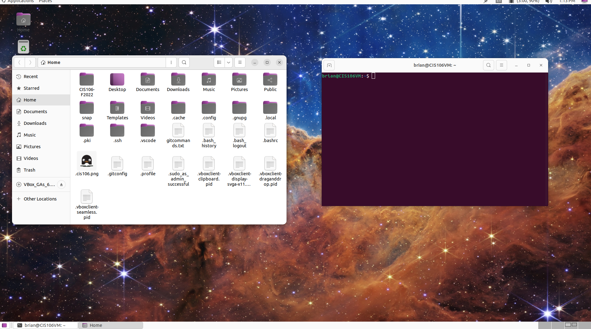

# Lab 3 Submission
## No Submission

## Question 2

## Question 3
| Program purpose     | Package Name     | Version                  |
| ------------------- | ---------------- | ------------------------ |
| Play a tetris game  | blockattack      | 2.7.0-1 amd64            |
| Play a video file   | dragonplayer     | 4:21.12.3-Oubuntu1 amd64 |
| Browse the internet | epiphany-browser | 42.3-Oubuntu1 amd64      |
| Read your email     | gnome-gmail      | 2.9-3 all                |
| Play music          | rhythmbox        | 3.4.4-5ubuntu1 amd64     |

1)Which command did you use?
sudo apt install blockattack dragonplayer epiphany-browser gnome-gmail rhythmbox

2)Which command did you use?
sudo apt remove blockattack dragonplayer ephipahny-browser gnome-gmail rhythmbox

3)which command will you use to install and remove?
sudo apt install (software)+ (software)-

## Question 4 
| command | what it does                                                 |
| ------- | ------------------------------------------------------------ |
| echo    | displays line of text                                        |
| fortune | prints random adage                                          |
| cowsay  | an image of a cow saying something thats written by the user |
| lolcat  | colorful effects                                             |
| figlet  | large characters made up of screen characters               |
| toilet  | display large colorful characters                            |
| rig     | random identity generator                                   |