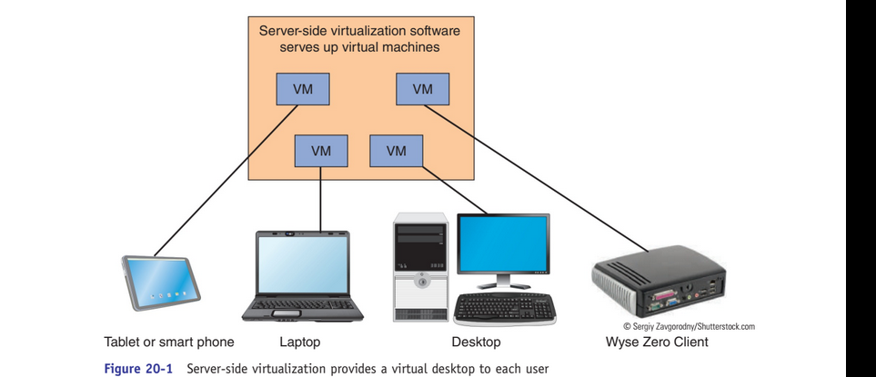
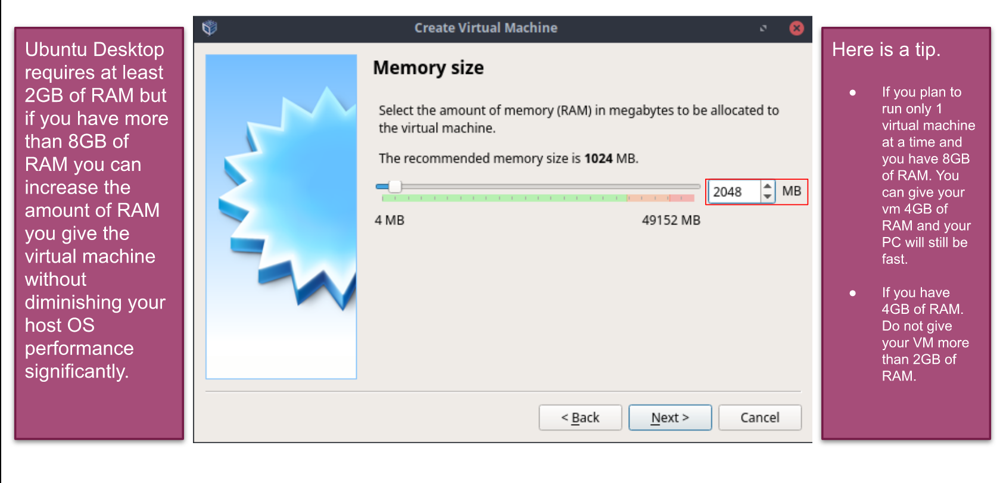
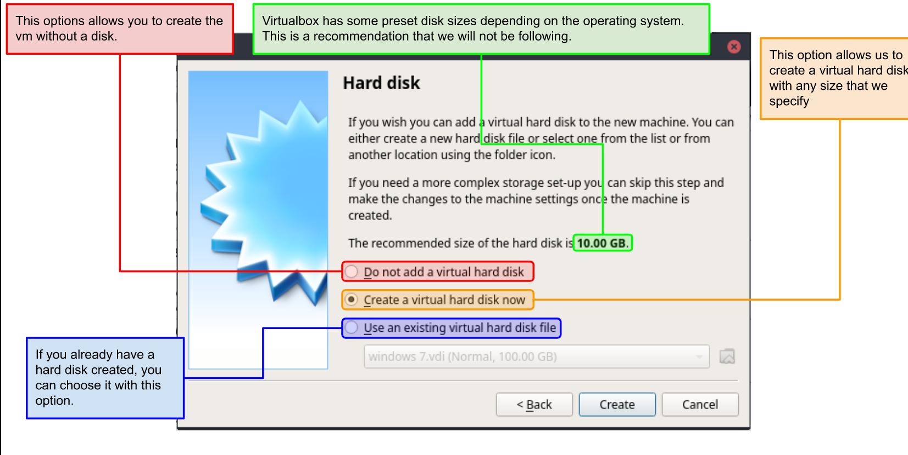
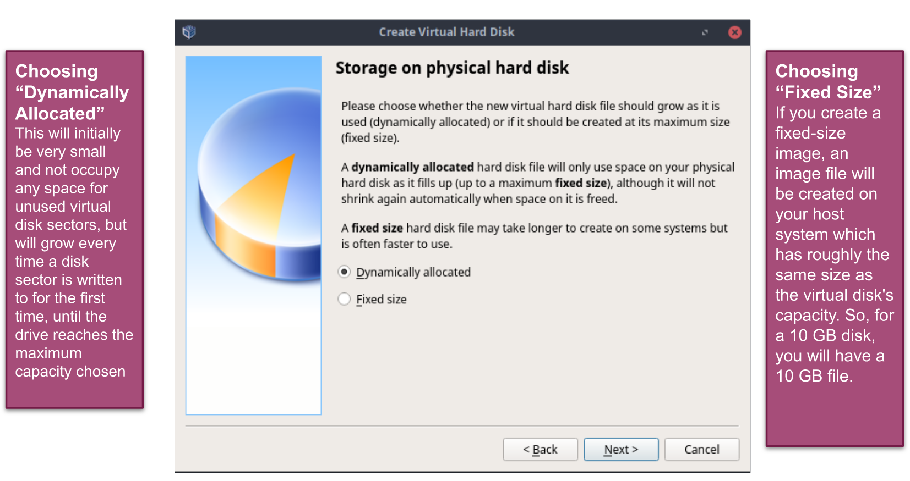
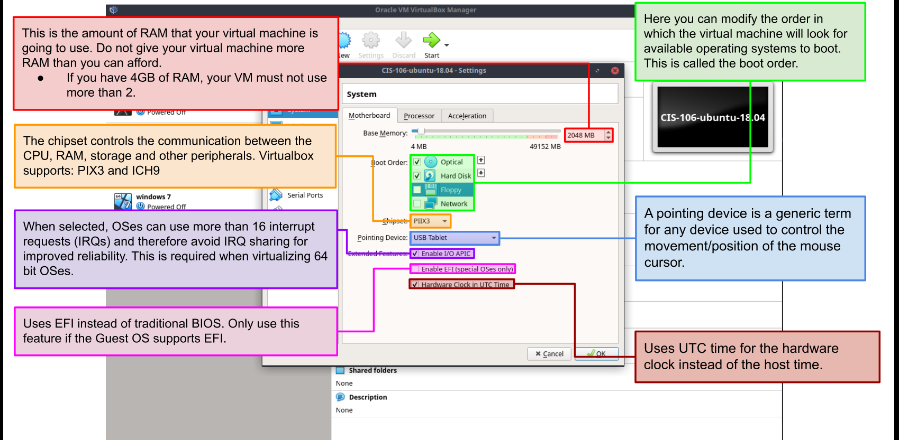
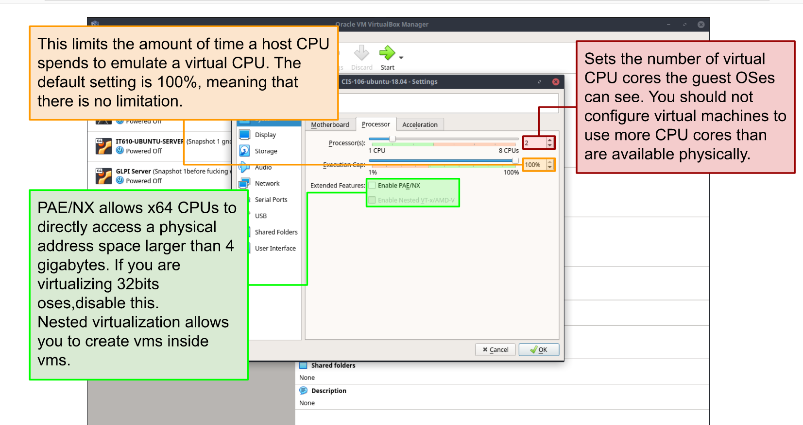

# Week Report 2

## The basics of virtualization

1. **What is virtualization?**
Definition of virtualization- Replication of hardware to simulate a virtual machine inside a physical machine.

2. **Types of virtualization**
Two types of virtualization, server side virtualization and client side virtualization. The difference between the two is where each take place.
**Server Side Virtualization**

**Client Side Virtualization**

## Installing Ubuntu in Virtualbox

