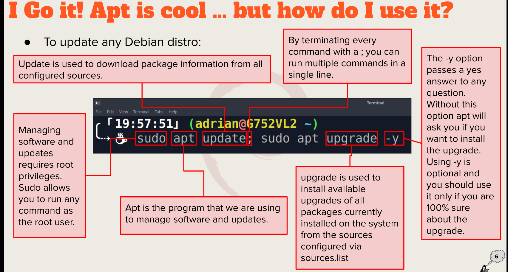

## Week Report 3/ Homework 3 ##

A. Summary of presentations

1. Different desktop enviroments
   *GNOME
   *XNOME

2. Definitions of GUI, and De
    *GUI- Graphical User interface
    *De-Desktop Enviroments
3. Common elements of a dekstop environment
    *Taskbar
    *Basic programs

B. Bash Shell

1. What is a shell?
    *Allows the user to input commands into the computer
2. List different shells
    *GNOME

3. List some bash shortcuts 
    *Ctrl+C 
    *Ctrl+L
    *Ctrl+R
    *Ctrl+V
    *CTRL+X
4. List basic commands and their usage
   *Sudo apt update- gets the updates for program 
   *sudo apt upgrade- installs the update
   *exit- exits the terminal 

C. Managing Software

1. Command for updating ubuntu 
   * sudo apt update; sudo apt upgrade -y

2. command for installing software
    * sudo apt install (program name)
3. Command for removing software
    *sudo apt remove (program name)
4. Command for searching for software
    *sudo apt search (program)
5. Definition of the following terms:
   1. Package- archives that contain binaries of software, configuration files nad information about dependencies
   2. Library- Reusable code that can be used by more than one function or program
   3. Repository- a large collection of software available for download

