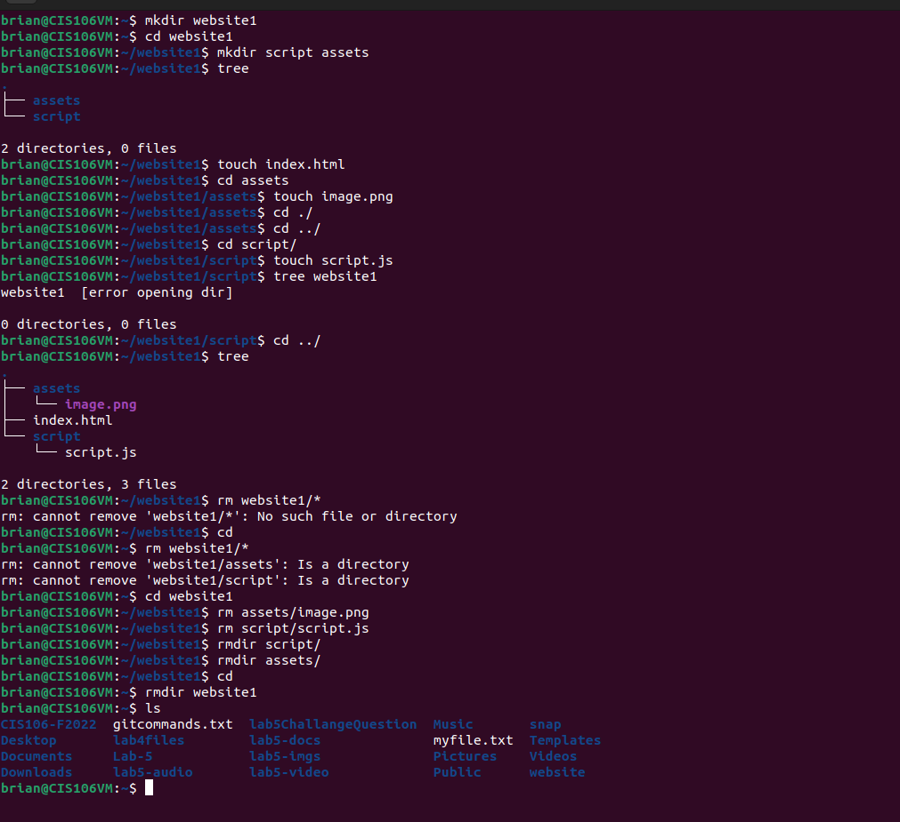
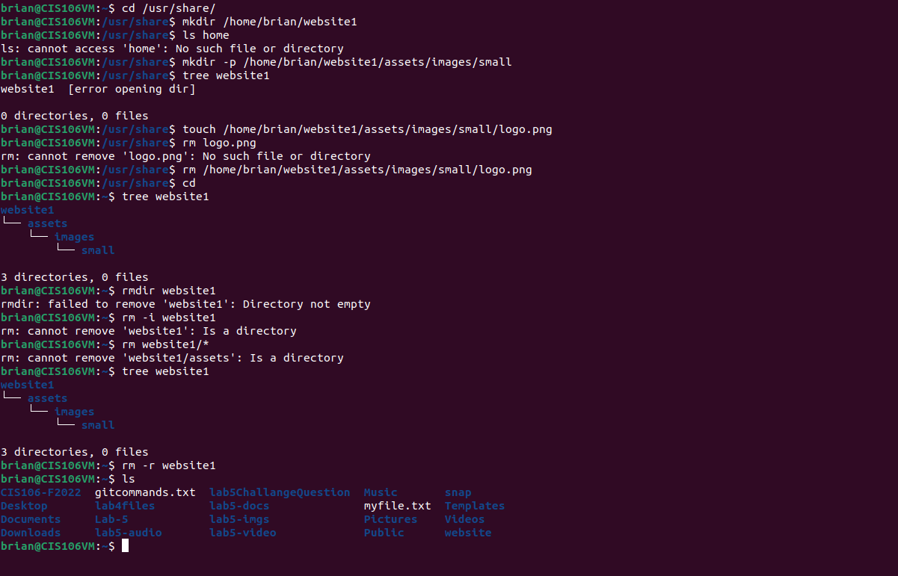
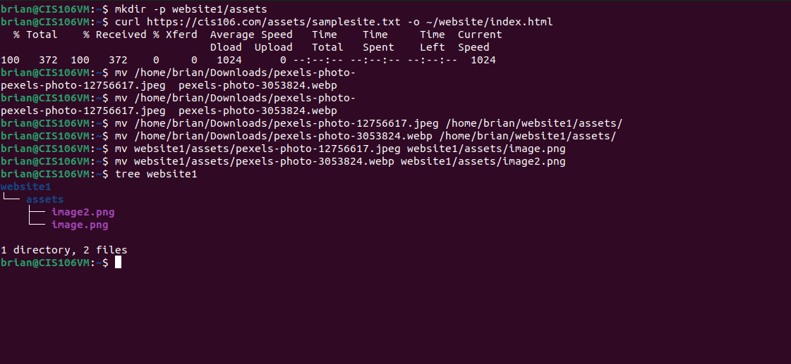
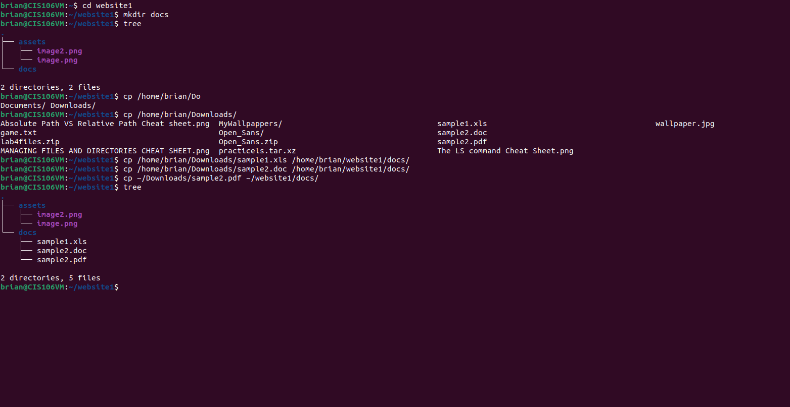

# Week Report 5
## What are Command Options?
A command options are options that modify and enhance the command behavior.
## What are Command Arguments?
Command Arguments are items open that the command acts on.
## Which command is used for creating directories? Provide at least 3 examples.
1. mkdir cat
2. mkdir cat/pictures
3. mkdir cat/docs cat/videos
## What does the touch command do? Provide at least 3 examples.
Creates files
1. touch cats
2. touch image.png
3. touch /home/brian/cat/cats
## How do you remove a file? Provide an example.
rm cat
## How do you remove a directory and can you remove non-empty directories in Linux? Provide an example
rmdir can remove a directory and rm -r can remove a non empty directory
rmdir -r cat
## Explain the mv and cp command. Provide at least 2 examples of each
The mv command allows you to move and rename files. CP is used to copy files into new directories
1. mv ~/cats/cats.png ~/cats/CatsAreBetterThanDogs.png
2. cp ~/Downloads/cats ~/Cats/Pictures

# Practices
## Practice 1

## Practice 2 

## Practice 3

## Practice 4
