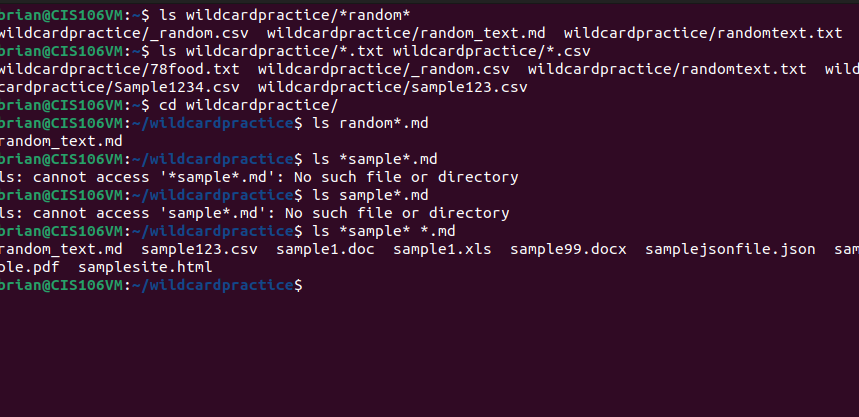

# Week Report 6

## Wildcards.

### * Wildcard
The * wildcard matches from 0 to any number of characters.
* Examples:
  * List all the text file in a directory
    * 'ls *.txt'
  * List all the files that start with the word file
    * 'ls file*'
  * Copy all the mp4 files
    * 'cp Downloads/*.mp4 ~/Videos/Movies/ '
### ? Wildcard
* Examples:
  * To list all hidden files use 
    * ls .??*
  * List all files that have two characters between letter b and k.
    * ls b??k*
  * List all the files that have a 3 letter file extension
    * ls *.???
### [] Wildcard
* Examples
  * Match all files that have a vowel after letter f:
    * ls f[aeiou]*
  * Match all the files that do not have a vowel after letter f:
    * ls f[!aeiou]*
  * Match all files that have a range of letters after f:
    * ls f[a-z]
### Brace Expansion
* Create a whole directory structure in a single command:
  * mkdir -p music/{jazz,rock}/{mpr3files,videos,oggfiles}/new{1..3}
* To create a N number of files use:
  * touch website{1..5}.html
  * touch file{A..Z}.txt
* Remove multiple files in a single directory
  * rm -r {dir1,dir2,dir3,file.txt,file.py}
## Practice 1

## Practice 2

## Practice 3
